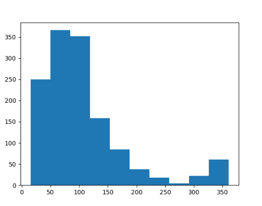
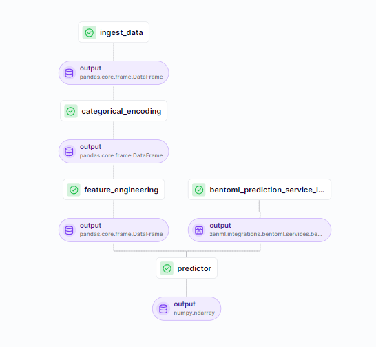
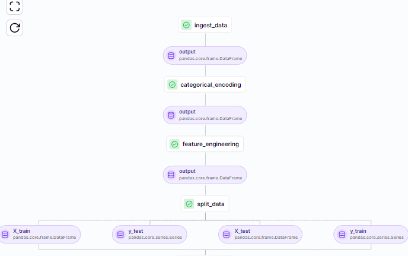
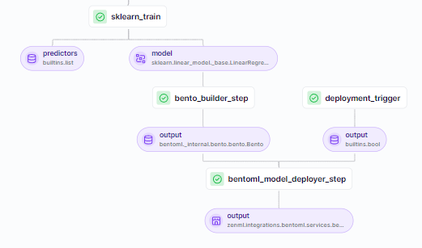

# Retail Price Optimization - Help them to sell more

In today's competitive retail market, setting the right price for products is crucial. This project focuses on retail price optimization using machine learning techniques to predict customer satisfaction scores. This is a crucial part of developing dynamic pricing strategies, leading to increased sales and customer satisfaction.

**Problem statement:** Our task is to develop a model that predicts the optimal price for a product based on various factors. This prediction would enable us to make an informed decision when pricing a product, leading to maximized sales and customer satisfaction.

The dataset's diverse features like product details, order details, review details, pricing, competition, time, and customer details provide a comprehensive view for our price optimization task.

By analyzing this information, we aim to predict the optimal price for retail products. This would aid in making strategic pricing decisions, thereby optimizing retail prices effectively.

The sample dataset includes various details about each order, such as:

- Product details: ID, category, weight, dimensions, and more.
- Order details: Approved date, delivery date, estimated delivery date, and more.
- Review details: Score and comments.
- Pricing and competition details: Total price, freight price, unit price, competitor prices, and more.
- Time details: Month, year, weekdays, weekends, holidays.
- Customer details: ZIP code, order item ID.

## 🐍 Python Requirements

Let's jump into the Python packages you need. Within the Python environment of your choice, run:

```python
git clone https://github.com/ayush714/retail-price-optimization-mlops.git
pip install -r requirements.txt
```

Starting with ZenML 0.20.0, ZenML comes bundled with a React-based dashboard. This dashboard allows you to observe your stacks, stack components and pipeline DAGs in a dashboard interface. To access this, you need to launch the ZenML Server and Dashboard locally, but first you must install the optional dependencies for the ZenML server:

```python
pip install zenml["server"]
zenml up
```

If you are running the `run_cid_pipeline.p`y` script, you will also need to install some integrations using ZenML:

```
zenml integration install mlflow -y
zenml integration install bentoml
```

The project can only be executed with a ZenML stack that has an MLflow experiment tracker and BentoML model deployer as a component. Configuring a new stack with the two components are as follows:

```
zenml experiment-tracker register mlflow_tracker --flavor=mlflow
zenml model-deployer register bentoml_deployer --flavor=bentoml
zenml stack register local_bentoml_stack \
  -a default \
  -o default \
  -d bentoml_deployer \
  -e mlflow_tracker
  --set
```

## 🚀 Training Pipeline

Our standard training pipeline consists of several steps:

- `ingest`: Ingests the data from the databas into the ZenML repository.
- `categorical_encoder`: Encodes the categorical features of the dataset.
- `feature_engineer`: Create new features from the existing features.
- `split`: Splits the dataset into train and eval splits.
- `train`: Trains the model on the training split.
- `evaluate`: Evaluates the model on the eval split.
- `decision`:
- `deploy`: Deploys the model to a BentoML endpoint.

## Results
### Prediction Results


### Inference Pipeline


### Training Pipeline




